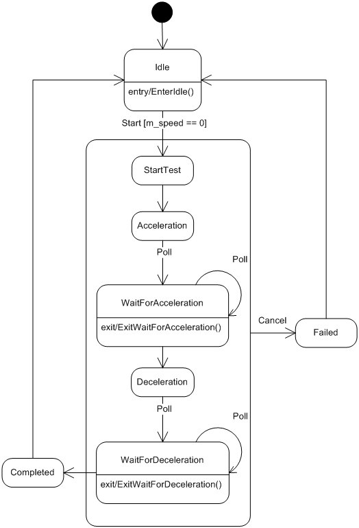

# C Language State Machine with Threads
A framework combining C language state machines and multicast asynchronous callbacks.

<h2>Introduction</h2>

A software-based Finite State Machines (FSM) is an implementation method used to decompose a design into states and events. Simple embedded devices with no operating system employ single threading such that the state machines run on a single &ldquo;thread&rdquo;. More complex systems use multithreading to divvy up the processing.

Many FSM implementations exist including one I wrote about here entitled &ldquo;<strong><a href="https://github.com/endurodave/C_StateMachine">State Machine Design in C</a></strong>&rdquo;. The article covers how to create C state machines. What is missing, however, is how to integrate multiple state machines into the context of a multithreaded environment.

&ldquo;<strong><a href="https://github.com/endurodave/C_AsyncCallback">Asynchronous Callbacks in C</a></strong>&rdquo; is another article I wrote. This design provides a simple, portable callback mechanism that handles the low-level details of asynchronously invoking a callback with event data on a client-specified thread of control.

This article combines the two previously described techniques, state machines and asynchronous callbacks, into a single project. In the previous articles, it may not be readily apparent using simple examples how multiple state machines coordinate activities and dispatch events to each other. The goal for the article is to provide a complete working project with threads, timers, events, and state machines all working together. To illustrate the concept, the example project implements a state-based self-test engine utilizing asynchronous communication between threads.

The primary focus is on how to combine the state machine and asynchronous callbacks into a single framework.

A CMake build offers easy experimentation in Windows, Linux and other platforms. No platform specific API's are utilized so any compiler toolchain will suffice.

Related articles:

<ul>
    <li><a href="https://github.com/endurodave/C_StateMachine">State Machine Design in C</a> - by David Lafreniere</li>
    <li><a href="https://github.com/endurodave/C_AsyncCallback">Asynchronous Callbacks in C</a> - by David Lafreniere</li>
	<li><a href="https://github.com/endurodave/C_Allocator">A Fixed Block Allocator in C</a> - by David Lafreniere</li>
    <li><a href="https://github.com/endurodave/StateMachine">State Machine Design in C++</a> - by David Lafreniere</li>
</ul>

<h2>Project Build</h2>

<a href="https://www.cmake.org">CMake</a> is used to create the build files. CMake is free and open-source software. Windows, Linux and other toolchains are supported. Example CMake console commands executed inside the project root directory: 

<h3>Windows Visual Studio</h3>

<code>cmake -G "Visual Studio 17 2022" -A Win32 -B ../C_StateMachineWithThreadsBuild -S .</code>

After executed, open the Visual Studio project from within the <code>C_StateMachineWithThreadsBuild</code> directory.

<h3>Linux Make</h3>

<code>cmake -G "Unix Makefiles" -B ../C_StateMachineWithThreadsBuild -S .</code>

After executed, build the software from within the C_StateMachineWithThreadsBuild directory using the command <code>make</code>. Run the console app using <code>./C_StateMachineWithThreadsApp</code>.

<h2>SelfTestEngine</h2>

<code>SelfTestEngine</code> is thread-safe and the main point of contact for client&rsquo;s utilizing the self-test subsystem. <code>CentrifugeTest</code> and <code>PressureTest</code> are members of <code>SelfTestEngine</code>. <code>SelfTestEngine</code> is responsible for sequencing the individual self-tests in the correct order as shown in the state diagram below. &nbsp;

<strong>Figure 2: SelfTestEngine State Machine</strong>

The <code>STE_Start</code> event initiates the self-test engine.

<pre lang="c++">
// Start external event
EVENT_DEFINE(STE_Start, NoEventData)
{
    // Given the Start event, transition to a new state based upon 
    // the current state of the state machine
    BEGIN_TRANSITION_MAP                                // - Current State -
        TRANSITION_MAP_ENTRY(ST_START_CENTRIFUGE_TEST)  // ST_Idle
        TRANSITION_MAP_ENTRY(CANNOT_HAPPEN)             // ST_Completed
        TRANSITION_MAP_ENTRY(CANNOT_HAPPEN)             // ST_Failed
        TRANSITION_MAP_ENTRY(EVENT_IGNORED)             // ST_StartCentrifugeTest
        TRANSITION_MAP_ENTRY(EVENT_IGNORED)             // ST_StartPressureTest
    END_TRANSITION_MAP(SelfTestEngine, pEventData)
}
</pre>

<code>SelfTestEngine</code> has one public event function, <code>STE_Start()</code>, that starts the self-tests. <code>STE_StatusCb</code> is an asynchronous callback allowing client&rsquo;s to register for status updates during testing.

<pre lang="c++">
#include "DataTypes.h"
#include "StateMachine.h"
#include "callback.h"

#ifdef __cplusplus
extern "C" {
#endif

typedef struct
{
    BOOL testActive;
} SelfTestStatus;

// Declare public callback interfaces
CB_DECLARE(STE_StatusCb, const SelfTestStatus*)
CB_DECLARE(STE_CompletedCb, void*)
CB_DECLARE(STE_FailedCb, void*)

// Declare the private instance of SelfTestEngine state machine
SM_DECLARE(SelfTestEngineSM)

// State machine event functions
EVENT_DECLARE(STE_Start, NoEventData)
EVENT_DECLARE(STE_Cancel, NoEventData)

void STE_Init();</pre>

As mentioned previously, the <code>SelfTestEngine</code> registers for asynchronous callbacks from each sub self-tests as shown below.

<pre lang="c++">
void STE_Init()
{
    // Register with CentrifugeTest and PressureTest state machines
    CB_Register(CFG_CompletedCb, STE_CompletedCallback, DispatchCallbackThread1, NULL);
    CB_Register(CFG_FailedCb, STE_FailedCallback, DispatchCallbackThread1, NULL);
    CB_Register(PRE_CompletedCb, STE_CompletedCallback, DispatchCallbackThread1, NULL);
    CB_Register(PRE_FailedCb, STE_FailedCallback, DispatchCallbackThread1, NULL);
}</pre>

One might ask why the state machines use asynchronous callbacks. If the state machines are on the same thread, why not use a normal, synchronous callback instead? The problem to prevent is a callback into a currently executing state machine, that is, the call stack wrapping back around into the same class instance. For example, the following call sequence should be prevented: <code>SelfTestEngine</code> calls <code>CentrifugeTest</code> calls back <code>SelfTestEngine</code>. An asynchronous callback allows the stack to unwind and prevents this unwanted behavior.

<h2>CentrifugeTest</h2>

The <code>CentrifugeTest</code> state machine diagram show below implements the centrifuge self-test described in &quot;<a href="https://github.com/endurodave/C_StateMachine"><b>State Machine Design in C</b></a>&quot;. The difference here is that the <code>Timer</code> class is used to provide <code>Poll</code> events via asynchronous callbacks.

<strong>Figure 3: CentrifugeTest State Machine</strong>

<h2>Timer</h2>

The <code>Timer</code> class provides a common mechanism to receive function callbacks by registering with <code>Expired</code>. <code>TMR_Start()</code> starts the callbacks at a particular interval. <code>TMR_Stop()</code> stops the callbacks.

<pre lang="c++">
void TMR_Init();
void TMR_Term();
BOOL TMR_Start(CB_CallbackFuncType cbFunc, CB_DispatchCallbackFuncType cbDispatchFunc, DWORD timeout);
void TMR_Stop(CB_CallbackFuncType cbFunc, CB_DispatchCallbackFuncType cbDispatchFunc);

// Called periodically by a thread to process all timers
void TMR_ProcessTimers();</pre>

<h2>Run-Time</h2>

The program&rsquo;s <code>main()</code> function is shown below. It creates the threads, registers for callbacks from <code>SelfTestEngine</code>, then calls <code>STE_Start()</code> to start the self-tests.

<pre lang="c++">
int main()
{
    // Initialize modules
    ALLOC_Init();
    TMR_Init();
	CB_Init();
    STE_Init();
    CreateThreads();

    // Register for SelfTestEngine callbacks on DispatchCallbackThread2
    CB_Register(STE_StatusCb, STE_StatusCallback, DispatchCallbackThread2, NULL);
    CB_Register(STE_CompletedCb, STE_CompletedCallback, DispatchCallbackThread2, NULL);
    CB_Register(STE_FailedCb, STE_FailedCallback, DispatchCallbackThread2, NULL);

    // Start SelfTestEngine
    SM_Event(SelfTestEngineSM, STE_Start, NULL);

    // Wait for SelfTestEngine to complete 
    while (!selfTestEngineCompleted)
        this_thread::sleep_for(1s);

    // Cleanup before exit
    ExitThreads();
    CB_Term();
    TMR_Term();
    ALLOC_Term();

    this_thread::sleep_for(1s);

    return 0;
}</pre>

<h2>Conclusion</h2>

The C state machine and asynchronous callbacks implementations can be used separately. Each is useful unto itself. However, combining the two offers a novel framework for multithreaded state-driven application development. The article has shown how to coordinate the behavior of state machines when multiple threads are used,&nbsp;which may not be entirely obvious when looking at simplistic, single threaded examples.

I&rsquo;ve successfully used ideas similar to this on many different PC and embedded projects. The code is portable to any platform with a small amount of effort. I particularly like idea of asynchronous callbacks because it effectively hides inter-thread communication and the organization of the state machines makes creating and maintaining self-tests easy.

